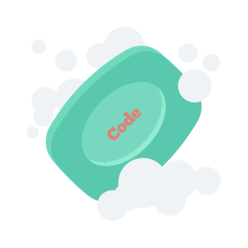

## Introduction

Recently, I was listening to an interview with Jim Keller, a legendary microprocessor engineer. During the conversation he says '*Good engineering is great craftsmanship'*, he emphasizes the importance of doing the simple things really well. This resonated because it's true that investing in the fundamentals will enable you to build a higher quality product. In boxing for example, the most important component is developing the foundational skills. Aside from the obvious reason to why this matters, it's also the only variable you can personally control. The opponent, circumstance, environment, and fatigue are always changing. What persists is your ability to engage those fundamental skills to get the job done. With this in mind, a simple fundamental in programming is the quality and craftsmanship of your code. Code should be elegant, clear, concise, and follow best practices for collaboration. Creating meaningful names is an important aspect of keeping your code clean. The following are some simple tips to making good names.

## Use Purpose-Revealing Names

It may be obvious to create a name that provides a description or purpose of the variable, object, class, function, and so forth. But this truly can be overlooked when beginning programming, and it is important to make it habitual early on. Ensure you are considering how that name will be utilized and making it clear what the purpose or functionality is. If you have to write comments to describe a function or variable, then the name is not providing intent.

`const ot; // oven timer`

Notice the above variable has a few issues. First, *ot* provides no indication as to what the variable is for. Additionally it is commented to provide a description, this is not a solution because the variable may be used again. Also, one or two letter names should be avoided as they do not provide any purpose and can also be misleading. This name could mean *Over Time, Occupational Therapy*, or anything else with that acronym. Which leads to my next tip...

## Avoid Misleading Names

When programming its imperative to avoid names that obscure the code' meaning. As shown above, when using an acronym or shortening a word, it can lead to a misinterpretation of what that code is for. So its best practice to be aware of the reserved names in your programming language, as well as any common acronyms to not cause misinformation.

Another example is an array named `staffList` which is a random group of new hire employees. This is problematic because we use the word *list* in the name, when the array itself is not a list. The name should be something like `newHireGroup` or just `newHires`, this makes it clearer and does not mislead other programmers. 

Further, using names that vary just slightly should be avoided as well. If you have a variable named `quantityOfOnHandInventory` and another named `quantityOfOffHandInventory`, this is not ideal. The small variant can be easily overlooked so names should always be **distinct**. 

Making the names distinct should be meaningful as well, not just work arounds to satisfy your scope restrictions. 

## Use Searchable Names

Another benefit of creating meaningful names is it makes them easier to search. This is the issue with names that are numerical or lack meaning, it becomes difficult to look them up. For example, it would be easy to grep `noteTaker` as opposed to a number or less unique name. 

## Conclusion

Ultimately their are many steps to take than can ensure more meaningful names, the above are just a few. It is important to stay on top of your names and update them as you come up with new ones. Remember, take the extra time to think through a proper name, it will result in less time taken in the future to fix issues and can prevent ones. For a much more comprehensive read on clean code and best naming practices, take a look at the book *[Clean Code by Robert C. Martin](https://www.amazon.com/Clean-Code-Handbook-Software-Craftsmanship/dp/0132350882/ref=sr_1_1?dchild=1&keywords=clean+code&qid=1619045410&sr=8-1)*. Lastly, don't forget to take care of the little things, its a recipe for great craftsmanship!