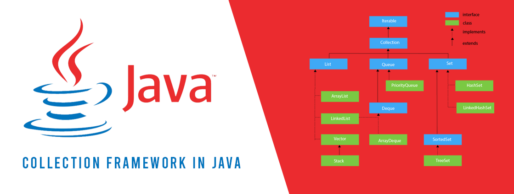

# What is a Collection in Java?

The **Collection in Java** is a framework that provides a readymade architecture of classes and interfaces. It is also optional, so in this sense it is more like a library with a group of objects that can be utilized for various functionality.

A collection means a single unit of objects. Java Collections can achieve operations we perform on data such as sorting, searching, mutation, insertion, and deletion. The framework provides many interfaces `(List, Set, Queue, Deque)` and classes `(LinkedList, ArrayList, Vector, PriorityQueue, LinkedHashSet, HashSet, TreeSet)`. Among these there are additional such as `Map` which is a Collection framework, but it does not inherit from the collection and instead has its own interface hierarchy.

# Hierarchy of the Framework

The Collection framework provides its classes and interfaces in the `java.util` package. Typically when one of these framework components are implemented, your IDE will prompt to import the `java.util` package to utilize. 

# *\-*

# Advantages of Java Collections

* **Easier to Code:** Enables you to focus on maximizing the program instead of spending time building reliable interfaces and classes for common functions
* **Program Efficiency:** Code execution is faster and of higher quality due to the readymade structures
* **Consistency:** It provides a consistent API with an essential arrangement of interfaces to streamline processes 

# Collections vs Arrays

Quite often I find their is a confusion about Collections, typically they will be thought of as Arrays or a various data  structure. Arrays are a much simpler construct, they have linear storage of a fixed size. Therefore they are limited to only storing a given amount of elements. Arrays are also homogenous, meaning they can only hold matching data types.

Collections on the other hand aren't so simple, they provide more sophistication and flexibility. First, they are resizable! Any number of elements can be added to a collection. They also provide support for homogenous AND heterogenous elements within the same collection.

# Conclusion

There is still much more to be said regarding collections and there implementation. In a later post I will dive deeper in to various common interfaces and classes that are leveraged using the Collection framework. Thus far we covered the basics and have a much better foundation to walk on. The fundamentals in programming are very essential! We can look at frameworks and libraries as tools; a Collection in Java is a native tool that can be leveraged to a high degree and even more so when we have a proper understanding of it. 

# *\-*